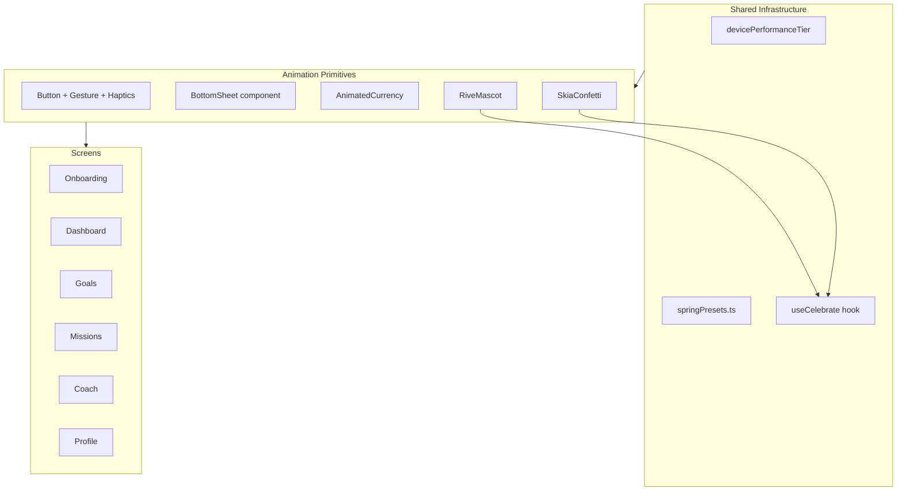

# Better Animations Implementation Plan

Upon approval, this plan will be written to `[implementations/BETTER_ANIMATIONS.md](implementations/BETTER_ANIMATIONS.md)` (directory will be created). All items use `- [ ]` checkboxes for progress tracking.

---

## Current State vs Guide

The app has **Reanimated 4** and **New Architecture** enabled (`[app.json](app.json)`), plus a partially correct `[Button](src/components/ui/button.tsx)` press animation and `[ProgressRing](src/components/ProgressRing.tsx)` (timing-based — correct for money surfaces per guide §5.6).

However, most motion still feels like fixed-duration fades:


| Area             | Current                                                              | Guide expectation                                             |
| ---------------- | -------------------------------------------------------------------- | --------------------------------------------------------------|
| Screen entrances | `MotiView` + `translateY` timing in 6+ screens                       | Reanimated `entering={FadeInDown.springify()}` with stagger   |
| Modals           | Moti slide-up; `AddExpenseModal` uses native `animationType="slide"` | Gesture Handler pan + velocity-aware spring snap (§5.2)       |
| Celebrations     | `react-native-confetti-cannon` (3 screens)                           | Skia particles + Rive trigger + haptic (§5.5)                 |
| Mascot           | Static emoji 🐷                                                      | Rive state machine inputs (§5.4)                              |
| Coach chat       | No bubble animation; JS `scrollToEnd`                                | Container enter + `LinearTransition`; UI-thread scroll (§5.3) |
| Lists            | `ScrollView` + `FlatList`                                            | `FlashList` where lists grow; animated scroll handlers        |
| Platform         | No ProMotion plist                                                   | `CADisableMinimumFrameDurationOnPhone: true` (§4)             |
| Haptics          | Partial (modals only)                                                | Paired with every key press/snap/celebration (§7)             |


**Missing dependencies** (not in `[package.json](package.json)`): `react-native-gesture-handler`, `@shopify/react-native-skia`, `rive-react-native`, `@shopify/flash-list`. `react-native-confetti-cannon` should be removed after Skia replacement.

---

## Architecture Target



---

## Operating Instructions

This plan runs autonomously across multiple sessions, not as a single one-shot task, so the following applies to every phase below, not just the one you happen to be working on:

- **Resume, don't restart.** Check each phase's checkbox and the `todos` status above before starting work. Phase 2 is `in_progress` — pick up where the unchecked boxes start rather than re-touching completed items. If a completed item looks wrong or incomplete when you open the file, flag it in your summary rather than silently redoing it.
- **Guide rules apply to every file you touch, not just the example named in a bullet.** E.g. the "one shared value per animation driver" rule, the haptic-pairing table, and spring-vs-timing choice (§5) apply to every screen and component in Phases 2–5, even where a bullet only calls out one file as the example.
- **Match the checklist scope, don't expand it.** Implement what a checkbox describes; don't add extra config options, abstractions, or defensive handling beyond what's asked. If you think a phase is missing something the guide would want, note it in your summary instead of building it unprompted.
- **Confirm before anything irreversible.** Uninstalling a package (`react-native-confetti-cannon` in Phase 0/6), deleting a file (`useFocusKey.ts` in Phase 6), or removing an import used elsewhere — check with the user first, since these can't be undone automatically once the working tree changes.
- **Verify before checking a box off.** Where the project has typecheck/lint/tests available, run them after finishing a checklist item before marking it complete. Update the checkbox and the `todos` status together so the file stays an accurate source of truth for the next session.
- **Full findings over pre-filtered ones (Phase 7 especially).** When auditing against §8, report everything you find with a severity/confidence note rather than dropping anything that seems minor — filtering can happen afterward, but a dropped finding is easy to lose track of.

---

## Phase 0 — Platform & Dependencies

- [ ] Add `react-native-gesture-handler` as explicit dependency; ensure `GestureHandlerRootView` wraps app in `[app/_layout.tsx](app/_layout.tsx)`
- [ ] Install `@shopify/react-native-skia`, `rive-react-native`, `@shopify/flash-list`
- [ ] Add iOS ProMotion key to `[app.json](app.json)`:
  ```json
  "ios": { "infoPlist": { "CADisableMinimumFrameDurationOnPhone": true } }
  ```
- [ ] Create `[src/lib/devicePerformanceTier.ts](src/lib/devicePerformanceTier.ts)` — returns `'high' | 'mid' | 'low'` (use `expo-device` or heuristic); consumed by Skia/Rive effects
- [ ] Create `[src/lib/springPresets.ts](src/lib/springPresets.ts)` — canonical `{ damping, stiffness }` values matching guide §5.1 (press: 15/300, sheet: 20/200)
- [ ] Remove `react-native-confetti-cannon` after Phase 4 Skia confetti ships (confirm with the user before uninstalling, per Operating Instructions above)

---

## Phase 1 — Shared Animation Primitives

Build once, reuse everywhere. New files under `src/components/animation/`:

- [ ] `**BottomSheet.tsx**` — Reanimated + Gesture Handler pan sheet per §5.2:
  - 1:1 finger tracking during drag
  - `withSpring` snap with `velocity` on release
  - Backdrop fade via shared `progress` value (single driver, rule 6)
  - Haptic on snap via `runOnJS` at completion only
- [ ] `**FadeInStagger.tsx**` — wrapper using Reanimated `entering={FadeInDown.springify().delay(i * 40)}` to replace repeated MotiView blocks
- [ ] `**AnimatedCurrency.tsx**` — shared value count-up via `useDerivedValue` + text props (§5.6); used on dashboard stat cards
- [ ] `**AnimatedProgressBar.tsx**` — width via `transform: scaleX` + shared progress value (not layout `width` per rule 2, since animating layout-affecting properties forces the JS thread to re-measure every frame)
- [ ] `**SkiaConfetti.tsx**` — single Canvas, one `confettiProgress` shared value, precomputed particle constants (§5.5); particle count from `devicePerformanceTier`
- [ ] `**useCelebrate.ts**` — orchestrates haptic → Rive trigger → confetti progress (§5.5)
- [ ] `**PressableScale.tsx**` — canonical §5.1 tap pattern with `Gesture.Tap()` + haptic `selectionAsync()` for chips/tabs/list rows; this is the one tap primitive for the whole app, so prefer it over ad-hoc `Pressable` + manual scale wherever a new tap target is added in later phases

Refactor existing:

- [ ] `[ScreenTransition.tsx](src/components/ScreenTransition.tsx)` — replace `withTiming(220ms)` with `withSpring` (opacity + scale from 0.97); merge opacity+scale into one progress shared value
- [ ] `[button.tsx](src/components/ui/button.tsx)` — migrate press handling to `Gesture.Tap()`; add `Haptics.selectionAsync()` on press; consolidate `scale` + `translateY` under one `pressed` shared value via `interpolate`

---

## Phase 2 — Modal & Sheet Migration

Replace all modal motion with the shared `BottomSheet`. Use it as-is from Phase 1 — this phase is a swap, not a place to extend `BottomSheet`'s API unless one of these three screens genuinely can't work without a new prop.

- [ ] `[picker-modal.tsx](src/components/ui/picker-modal.tsx)` — swap Moti + `FlatList` → `BottomSheet` + `FlashList` (`estimatedItemSize: 64`); keep existing haptics on select
- [ ] `[calendar-modal.tsx](src/components/ui/calendar-modal.tsx)` — swap Moti → `BottomSheet`; pan-to-dismiss
- [ ] `[AddExpenseModal.tsx](src/components/AddExpenseModal.tsx)` — remove native `animationType="slide"`; use `BottomSheet`; add category chip `PressableScale` + selection haptic

---

## Phase 3 — Screen-by-Screen Upgrades

The same Moti → Reanimated migration pattern applies to every screen below — it's only spelled out in full for Onboarding as the reference example; apply the equivalent (entrance stagger, spring not timing, haptic on interaction) to the rest even where a screen's bullets are shorter.

### Onboarding `[app/onboarding.tsx](app/onboarding.tsx)`

- [ ] Replace 8× `MotiView` step entrances with Reanimated `FadeInDown.springify()` + shared step transition wrapper
- [ ] Animate progress bar segments (shared value driven by `step`) instead of instant class toggle
- [ ] Chip selectors (`GOAL_CHIPS`, `TIMELINE_CHIPS`) → `PressableScale` + haptic
- [ ] Success screen (step 8): wire `useCelebrate()` instead of `ConfettiCannon`
- [ ] Placeholder for Rive mascot on welcome/success screens (emoji → `RiveMascot` once asset exists)

### Dashboard `[app/(tabs)/index.tsx](app/(tabs)`/index.tsx)

- [ ] Replace `MotiView` stagger blocks with `FadeInStagger` (delays 0, 60, 120… ms preserved)
- [ ] `AnimatedCurrency` on "Today's Spending", "Saved Today", "Saved This Month"
- [ ] Goal carousel dots: animate width/active state with shared value tied to scroll (or spring on index change)
- [ ] Goal list progress bars → `AnimatedProgressBar`
- [ ] XP bar → `AnimatedProgressBar`
- [ ] Streak dots: spring scale-in when active
- [ ] Keep `[ProgressRing](src/components/ProgressRing.tsx)` timing (correct for money); optionally migrate stroke to Skia path later for visual polish

### Goals `[app/(tabs)/goals.tsx](app/(tabs)`/goals.tsx)

- [ ] Same Moti → Reanimated entrance migration via `useFocusKey` wrapper
- [ ] Deposit success → `useCelebrate()` replacing `ConfettiCannon`
- [ ] Create-goal step transitions match onboarding pattern

### Missions `[app/(tabs)/missions.tsx](app/(tabs)`/missions.tsx)

- [ ] Mission complete → `useCelebrate()` + haptic success
- [ ] Segmented tab switch: spring indicator slide (shared value, not instant bg swap)
- [ ] Mission card check animation (scale spring on complete)

### Coach `[app/(tabs)/coach.tsx](app/(tabs)`/coach.tsx)

- [ ] Message bubbles: `entering={FadeInDown.springify()}` + `layout={LinearTransition.springify()}` per §5.3
- [ ] Typing indicator: UI-thread `withRepeat(withTiming(...))` while awaiting response (replace bare 600ms timeout appearance)
- [ ] Scroll-to-bottom: `useAnimatedScrollHandler` + Reanimated `scrollTo` (replace `onContentSizeChange` + ref)
- [ ] Starter chips → `PressableScale` + haptic

### Profile `[app/(tabs)/profile.tsx](app/(tabs)`/profile.tsx)

- [ ] Add `ScreenTransition` wrapper (currently missing)
- [ ] Staggered section entrances
- [ ] Achievement unlock states: subtle spring badge pop

### Tab bar `[app/(tabs)/_layout.tsx](app/(tabs)`/_layout.tsx)

- [ ] Focused tab icon: spring scale + background pill width via Reanimated (custom `tabBarButton` or animated icon wrapper)

---

## Phase 4 — Character & Celebrations (Rive)

Requires a `.riv` mascot asset (design deliverable) — treat this as a hard blocker for the asset-dependent items only; the `useCelebrate()` wiring below doesn't need the asset and can proceed with the emoji fallback:

- [ ] Add bundled `assets/mascot.riv` with state machine `CharacterMachine` (inputs: `celebrate`, `concerned`, `idle`, `progress`)
- [ ] `**RiveMascot.tsx**` — wrapper per §5.4; expose `fireCelebrate()`, `setProgress(n)`
- [ ] Integrate mascot on: dashboard header, coach header, onboarding welcome, celebration moments
- [ ] Wire `useCelebrate()` across onboarding success, mission complete, goal deposit, achievement unlock

---

## Phase 5 — ProgressRing & Money Surfaces

- [ ] `[ProgressRing.tsx](src/components/ProgressRing.tsx)` — keep `withTiming` + gentle easing (no overshoot); verify no layout-triggering props animated
- [ ] Optional: migrate ring arc from SVG to Skia `Path` for smoother 120Hz rendering (only if profiling shows need — don't do this speculatively)
- [ ] Dashboard goal slider amounts: consider `AnimatedCurrency` inside ring center when goal changes

---

## Phase 6 — Cleanup & Deprecation

Everything in this phase removes code, so confirm with the user before deleting a file or uninstalling a package, per Operating Instructions — a bad delete here isn't recoverable the way an unwanted new file is.

- [ ] Remove all `MotiView` / `AnimatePresence` imports once screens migrated (keep `moti` dep only if still used; otherwise remove)
- [ ] Delete `[useFocusKey.ts](src/hooks/useFocusKey.ts)` if replaced by Reanimated focus-triggered shared value reset (or keep if still needed for remount strategy)
- [ ] Grep audit: zero hits for `Animated.` (RN legacy), `LayoutAnimation`, `PanResponder`, `animationType="slide"`, `confetti-cannon`
- [ ] Uninstall `react-native-confetti-cannon`

---

## Phase 7 — Verification (Guide §8 Procedure)

- [ ] Run banned-API search across codebase
- [ ] Manual pass: all 8 hard rules (§3) on every animation file — report every violation found with a severity note; don't pre-filter to only the ones that seem serious
- [ ] Profile UI-thread FPS on iPhone ProMotion device + low-end Android
- [ ] Verify haptic pairing table (§7) on buttons, sheet snaps, celebrations, errors
- [ ] Re-test after any RN/Reanimated upgrade

---

## Suggested Implementation Order

Work in this sequence to minimize rework:

1. Phase 0 (deps + platform)
2. Phase 1 primitives (`BottomSheet`, `PressableScale`, spring presets)
3. Phase 2 modals (immediate UX win, removes worst defects)
4. Phase 3 screens (dashboard + onboarding first — highest visibility)
5. Phase 4 Rive (blocked on asset; use emoji fallback until ready)
6. Phases 5–7 (polish + audit)

---

## Key Files Reference


| File                                                                         | Primary change                      |
| ----------------------------------------------------------------------------| -------------------------------------|
| `[guides/ANIMATION_GUIDE.md](guides/ANIMATION_GUIDE.md)`                     | Source of truth — do not contradict |
| `[app.json](app.json)`                                                       | ProMotion plist                     |
| `[src/components/ui/button.tsx](src/components/ui/button.tsx)`              | Gesture + haptics                   |
| `[src/components/ScreenTransition.tsx](src/components/ScreenTransition.tsx)` | Timing → spring                     |
| `[app/onboarding.tsx](app/onboarding.tsx)`                                   | Largest Moti surface                |
| `[app/(tabs)/index.tsx](app/(tabs)`/index.tsx)                               | Stagger + animated numbers          |
| `[app/(tabs)/coach.tsx](app/(tabs)`/coach.tsx)                               | Chat streaming pattern              |
| New: `src/components/animation/*`                                            | Shared primitives                   |
| New: `implementations/BETTER_ANIMATIONS.md`                                  | This checklist (deliverable)        |


---

## Out of Scope (for now)

- Lottie onboarding loops (§6 — only if marketing assets exist)
- Shared-element hero transitions between screens (§5.7 — no hero flows yet)
- Full FlashList migration of short dashboard `ScrollView` sections (only long/searchable lists)
